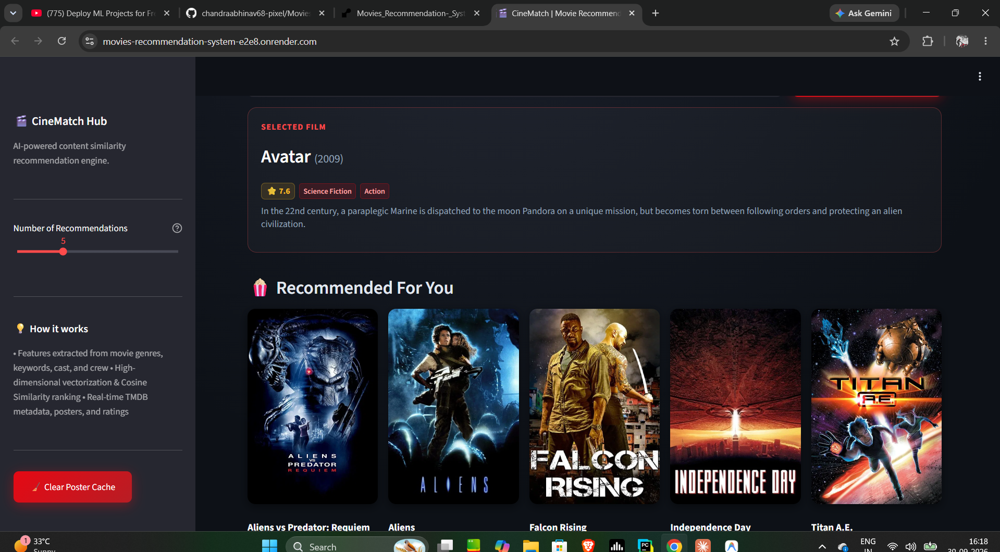

# 🎬 CineMatch: Movie Recommendation System

A content-based movie recommender built with Python and Streamlit. Pick a movie you like and CineMatch suggests similar films, complete with posters, ratings, genres, and overviews pulled live from the TMDB API.

**🔗 Live demo:** https://movies-recommendation-system-e2e8.onrender.com

> The app is hosted on Render's free tier, so the first load after a period of inactivity can take 50 seconds or more while the instance wakes up.



## Features

- Search any movie from the TMDB 5000 dataset and get similar recommendations
- Adjustable number of recommendations with a sidebar slider
- Live posters, ratings, genres, and plot overviews from the TMDB API
- Poster caching to keep the app fast, with a one-click "Clear Poster Cache" button
- Custom dark, cinema-style UI

## How it works

1. **Data:** The TMDB 5000 Movies and Credits datasets are merged and cleaned.
2. **Feature engineering:** For each movie, genres, keywords, top cast, and crew (such as the director) are combined into a single "tags" text field.
3. **Vectorization:** The tags are converted into numerical feature vectors.
4. **Similarity:** Cosine similarity is computed between every pair of movies and stored in `similarity.pkl`.
5. **Recommendation:** When you pick a movie, the app looks up its row in the similarity matrix and returns the top N most similar movies.
6. **Metadata:** Posters, ratings, and overviews are fetched from TMDB at request time.

The full data preparation and model-building workflow is in `Movie_recommendation_system.ipynb`.

## Tech stack

| Area | Tools |
|---|---|
| Language | Python 3.14 |
| Web app | Streamlit |
| Data processing | Pandas, NumPy |
| External API | TMDB API via `requests` |
| Deployment | Render |

## Project structure

```
├── app.py                          # Streamlit application
├── Movie_recommendation_system.ipynb  # Data prep and model building
├── movies.pkl                      # Processed movie data
├── similarity.pkl                  # Cosine similarity matrix
├── tmdb_5000_movies.csv            # Raw dataset
├── tmdb_5000_credits.csv           # Raw dataset
└── requirements.txt                # Pinned dependencies
```

## Run it locally

```bash
# 1. Clone the repository
git clone https://github.com/chandraabhinav68-pixel/Movies_Recommendation-_System.git
cd Movies_Recommendation-_System

# 2. Create and activate a virtual environment
python -m venv .venv
.venv\Scripts\activate        # Windows
# source .venv/bin/activate   # macOS / Linux

# 3. Install dependencies
pip install -r requirements.txt

# 4. Set your TMDB API key
set TMDB_API_KEY=your_key_here          # Windows (cmd)
# $env:TMDB_API_KEY="your_key_here"     # Windows (PowerShell)
# export TMDB_API_KEY=your_key_here     # macOS / Linux

# 5. Run the app
streamlit run app.py
```

Get a free API key at [themoviedb.org](https://www.themoviedb.org/settings/api).

## Deployment notes

The `.pkl` files are pickled with specific NumPy and Pandas versions, so `requirements.txt` pins the exact versions used to create them. If you regenerate the pickles, make sure the deployed environment uses the same versions.

## Future improvements

- Filters by genre, year, and rating
- Hybrid recommendations that combine content-based and collaborative filtering
- Search suggestions and autocomplete
- Watchlist and favorites

## Acknowledgements

- [TMDB](https://www.themoviedb.org/) for the dataset and API. This product uses the TMDB API but is not endorsed or certified by TMDB.

## Author

**Abhinav Chandra**
GitHub: [@chandraabhinav68-pixel](https://github.com/chandraabhinav68-pixel)
